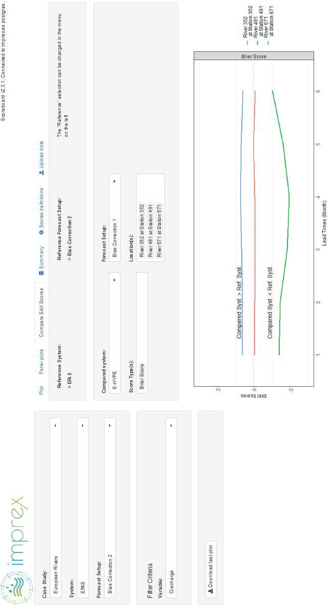

# Summary

“SHyP” (Scoreboard for Hydrometeorological Predictions) is a scoreboard utility for hydrological and meteorological predictions that aims to help modellers, decision-makers and users to visualize and compare the performance/skill of several models or model configurations in a unique platform allowing for easy comparisons [@ramos]. It is an open source tool containing two major features: 1) an interface to display scores of hydrometeorological predictions (i.e., metrics that evaluate the quality of the predictions) and 2) the structure of a database for storing these scores. 

The performance of a modelling system is measured by the quality of the predictions delivered by the system. The quality of forecasts or predictions in hydrometeorology depends on how well the prediction compares against a representative observation. It is usually estimated using metrics also called scores, which are quantitative measures of the forecast quality. In meteorology and hydrology, the quality of a prediction is assessed through a wide range of scores [@casati; @wilks; @jolliffe; @brown; @crochemore]. The scores used in practice differ between modellers, depending on the statistical attribute of the predictions that is of interest and sometimes preference or familiarity [@EFAS; @demargne; @zappa; @brown; @alfieri; @nicolle].

There are several reasons for assessing the quality of model predictions in hydrometeorology. For instance, it can guide decisions on the additional human and/or financial resources needed to further develop modelling systems; judge how changes in modelling approaches affect the quality of predictions; improve our understanding of uncertainties, sensitivities and biases present in forecasting; understand the drivers of performance in a modelling system as well as the strengths and weaknesses of different modelling approaches. 

Evaluating predictions in hydrometeorology can help modellers and service providers to gain confidence in the system and produced outputs, communicate better, and further improve decision-making. As noted by @book_verification, evaluation of predictions serves multiple actors (data providers, model developers, operational forecasters, decision makers, and other users of model predictions in general). Consequently, evaluation can be performed in different ways, depending on the objective, and the challenges that decision-makers have to address at the end of the chain. Additionally, model performance comparison is very useful when different teams work on a same river (location) or case study, but with different modelling approaches. A scoreboard can display and compare model performance under different situations.

Despite their importance, scoreboards for hydrometeorological predictions are however rare. Sharing a scoreboard – a tool which allows transparency, comparison and openness in computational experiments – is an excellent opportunity for collaborative projects, particularly when the tool provides a back-end data repository combined with a shared graphical interface. This combination allows analyses and updates to be performed by several users, potentially at the same time. 

The “SHyP” scoreboard framework has been developed to facilitate model evaluation and comparison by centralizing the scores of model predictions in the same utility and providing an interfaced standard visualization. It produces plots and facilitates their analysis without the need of substantial knowledge on computer programming. Besides, since it can be hosted on a website, it could allow any user to use the tool’s interface for the visualization of model performance. The tool is filled with a database of scores, therefore it allows users to openly display their score values without the need of making large amount of prediction (model output) data available. With wider and repetitive usage, the look and feel will become familiar aiding more effective decision making.

The “SHyP” scoreboard interface is coded in R [@R_Team]. It makes use of the capabilities of the ‘shiny’ package [@shiny] to guide the user while selecting the geographic areas, case study and scores of interest. Graphs are interactively plotted by the interface. Overall, the interface contains a panel on the left for selecting the configuration of the chosen experiments to analyse and the target locations and the option to automatically generate and export png plots (Figure 1). The interface also contains several tabs for displaying and comparing scores: single plot, panel plots for comparing different locations of a single configuration, plots for comparing two configurations with the same score, a summary of the scores database, a definition of the scores and a final tab for uploading users’ scores. An important feature is that the scores are not calculated by the “SHyP” scoreboard as this would replicate the functionality of existing packages. They need to either be calculated by the users or take advantage of the scores already being present in the database. This keeps the database manageable when using the scoreboard on many systems concurrently, since predictions are usually evaluated on the basis of long time-series (commonly between 10 and 30 years) with high temporal resolution (daily or even hourly time steps). Many tools already exist to calculate these scores [e.g. the ‘verification’ R package, @verification]. A scoresheet with names and equations of usual scores in hydrometeorological applications is provided within “SHyP”. In the interface, a tab is available to upload new scores (already computed). Two formats are allowed: 1) txt files and 2) RDS (native R format), with formats defined in the documentation. The uploaded scores are organised in an SQL database whose architecture can be created through a script that is provided and can be run in postgreSQL (https://www.postgresql.org/). This allows for fast reaction from the interface when a specific set is selected by the user.

# Acknowledgements

This work was supported by the IMPREX project funded by the European Commission under the Horizon 2020 framework program (grant 641811).

# References
